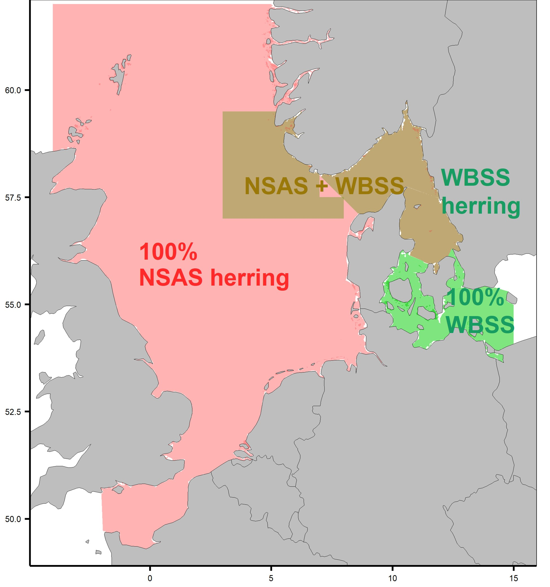
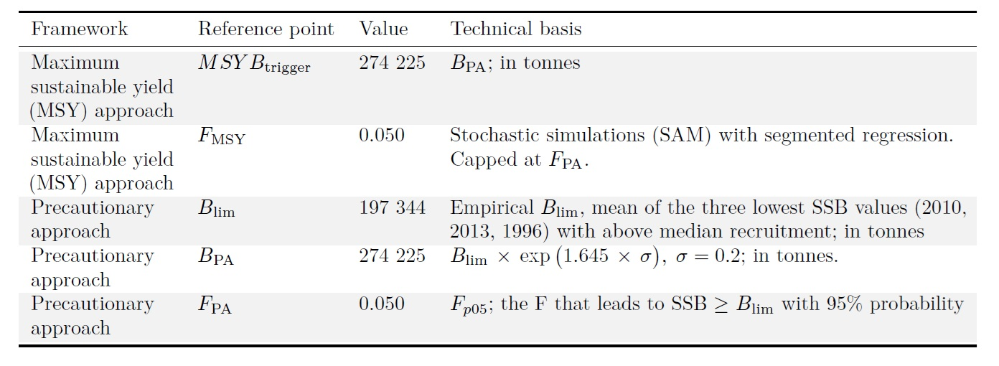

---
title: WBSS 2026 assessment
author: Vanessa Trijoulet
date: '`r Sys.Date()`'
output: 
  #md_document:
  powerpoint_presentation: 
    reference_doc: navy_modified.pptx
    #slide_level: 3 # use this to override default
    
...

```{r, echo = FALSE}
## Stuff that may need changing every year
library(stockassessment)
library(tabulapdf) # needed for extracting tables from pdf, Install Java x64 (and x32), Install rJava, finally remotes::install_github(c("ropensci/tabulizerjars", "ropensci/tabulizer"))
library(kableExtra)
thisY=as.numeric(substring(Sys.Date(),1,4))
lastY=thisY-1 
dir="Presentation_results"
      
Blim=197344
```

```{r, echo = FALSE, eval=FALSE}
#library(rmarkdown)
#if (packageVersion("stockassessment")<0.9) devtools::install_github("fishfollower/SAM/stockassessment", ref="multi")
#setwd(dir)
# render("Make_slideVes_outputs.Rmd", rmarkdown::powerpoint_presentation(reference_doc = "~/DTU/Conferences and meetings/DTU templates/DTU Template 16_9 - Navy blue Rmd.pptx"))

```


```{r, echo = FALSE, eval=FALSE}

# Because problem with fitfromweb this year for last year fits:
# url_user <- "https://www.stockassessment.org/datadisk/stockassessment/userdirs/user295/"
# load(url(paste0(url_user, "WBSS_HAWG_",lastY, "/run/model.RData")))
# fitlastY<- fit
# rm(fit)

# load(url(paste0(url_user, "WBSS_HAWG_2025_bench_fit15", "/run/model.RData")))
# fitlastY <- fit
# rm(fit)
# load(url(paste0(url_user, "WBSS_HAWG_2025_bench_bestmodel", "/run/model.RData")))
# fitlastY_mf <- fit
# rm(fit)

# load(url(paste0(url_user,"WBSS_HAWG_",lastY,"_sf", "/run/model.RData")))
# fitlastYsf<- fit
# rm(fit)
# fitlastY<- fitfromweb(paste0("WBSS_HAWG_",lastY), character.only = TRUE)
# fitlastYsf<- fitfromweb(paste0("WBSS_HAWG_",lastY,"_sf"), character.only = TRUE)

fitlastY <- fitfromweb("WBSS_HAWG_2025_sf_benchmark_fit15", character.only = TRUE)
fitlastY_mf <- fitfromweb("WBSS_HAWG_2025_benchmark_bestModel", character.only = TRUE)

fitthisY <- fitfromweb(paste0("WBSS_HAWG_",thisY), character.only = TRUE)
fitthisYmf <- fitfromweb(paste0("WBSS_HAWG_",thisY,"_mf"), character.only = TRUE)

#fitssingle <- c(lastY=fitlastYsf, thisY=fitthisYsf)
fitssingle <- c(lastY=fitlastY, thisY=fitthisY)
fitsmulti <- c(lastY=fitlastY_mf, thisY=fitthisY_mf)
fitsthisY <- c(single=fitthisY, multi=fitthisY_mf)

# catchlastY=catchbyfleettable(fitlastY)
catchlastYmf=catchbyfleettable(fitbenchMulti)
catchthisYmf=catchbyfleettable(fitthisY, obs.show = TRUE)
# catchlastY=catchtable(fitlastYsf)
catchlastY=catchtable(fitbench)
catchthisY=catchtable(fitthisY, obs.show = TRUE)

# extract observed catch
years <- fitthisYsf$data$years
idx <- which(fitthisYsf$data$aux[,"fleet"] == 1)
totalcatchage<-cbind(fitthisYsf$data$logobs[idx], fitthisYsf$data$aux[idx,]) # logs
weight <- fitthisYsf$data$catchMeanWeight[, , "Residual catch"]
totalcatch<-matrix(nrow=fitthisYsf$data$noYears, ncol=2)
totalcatch[,1]<-years
for(i in 1:fitthisYsf$data$noYears){
  totalcatch[i,2]<-sum(exp(totalcatchage[which(totalcatchage[,2]==years[i]),][,1])*weight[i,])
  if (totalcatch[i,2]==0) totalcatch[i,2]<-NA
}

```


```{r, echo=FALSE}
### Added to work on this repo
library(stockassessment)
# load what has been saved
setwd("../run")
for(f in dir(pattern="RData"))load(f) 
setwd("../")
setwd(dir)
fitthisY <- fit; rm(fit)
fitlastY <- fitBench
fitssingle <- c(lastY=fitlastY, thisY=fitthisY)
#fitsthisY <- c(single=fitthisY, multi=fitthisY_mf)
```


## WBSS assessment

- Category 1 stock
- SAM model on stockassessment.org 
- Benchmark in 2025: now single fleet SAM but data compilation still gear and area dependent
- New `r thisY` runs available online:
  + Single fleet: `r paste0("WBSS_HAWG_",thisY)` or https://github.com/vtrijoulet/2026_her.27.20-24_assessment
  + Multifleet: `r paste0("WBSS_HAWG_",thisY,"_mf")`
  


## Outline of presentation

- Inputs (observations)
  <!-- + Surveys -->
  <!-- + Catch -->
- Inputs (assumptions)
- Results of the assessment
  + Changes since last year
  + Comparison of the main outputs for the `r lastY` and `r thisY` assessments
  + Comparison `r thisY` single fleet vs. multifleet
  + Detailed `r thisY` assessment results
    <!-- + Residuals -->
    <!-- + Leave one survey out -->
    <!-- + Retrospective patterns -->
- Forecast settings and results
  <!-- + Forecast settings, reference points -->
  <!-- + Forecast settings, intermediate year -->


# Inputs (observations)  

## WBSS assessment data summary

```{r, echo = FALSE, fig.width=10, fig.height=10}
dataplot(fitthisY)
```

## WBSS survey input data

```{r, echo=FALSE, fig.dim=c(10,8)}

idx <- which(fitthisY$data$fleetTypes==2)
par(mfrow=c(2,2), mar=c(4,4,2,1))
for (k in idx){
  tmp <- log(getFleet(fitthisY, fleet=k))
  plot(tmp[,1]~rownames(tmp), ylim=c(min(tmp, na.rm=TRUE),max(tmp, na.rm=TRUE)), type="o", main=attr(fitthisY$data, "fleetNames")[k], ylab="Log index", xlab="")
  if(ncol(tmp)>1){
    for (i in 2:ncol(tmp))
      lines(tmp[,i]~rownames(tmp), col=i, type="o")
  }
  legend("topright", col=1:ncol(tmp), lty=1, pch=1, legend=colnames(tmp), bty="n")
}

```


## WBSS catch input data

```{r, echo=FALSE, fig.dim=c(10,4)}
catchatage <- getFleet(fitthisY,1,pred=FALSE)
newCw <- fitthisY$data$catchMeanWeight[,,1]
newSw <- fitthisY$data$stockMeanWeight

par(mfrow=c(1,3), mar=c(3,3,2,2))
matplot(y=log(catchatage), x=rownames(catchatage), type="l", ylab="", xlab="", col=1:ncol(catchatage), main="log(Catch at age)")
for(i in 1:ncol(catchatage)) text(y=log(catchatage[,i]), x=rownames(catchatage), labels = colnames(catchatage)[i], col=i)
matplot(y=newCw, x=rownames(newCw), type="l", ylab="", xlab="", col=1:ncol(newCw), main="Catch weights at age (kg)")
for(i in 1:ncol(newCw)) text(y=newCw[,i], x=rownames(newCw), labels = colnames(newCw)[i], col=i)
matplot(y=newSw, x=rownames(newSw), type="l", ylab="", xlab="", col=1:ncol(newSw), main="Stock weights at age (kg, Q1 Cw)")
for(i in 1:ncol(newSw)) text(y=newSw[,i], x=rownames(newSw), labels = colnames(newSw)[i], col=i)
```

# Inputs (assumptions)

## Mixing with NSAS herring

```{r, echo=FALSE}


```


## Natural mortality

:::::::::::::: {.columns}
::: {.column}

```{r, echo=FALSE, fig.dim=c(5,5)}
plot(y=fitthisY$data$natMor[1,], x=colnames(fitthisY$data$natMor), type="o", xlab="Age", ylab="M")
```


:::
::: {.column}

```{r M, echo=FALSE}
knitr::kable(rbind(fitthisY$data$natMor[1,]))

# kable(rbind(fitthisY$data$natMor[1,]),
#      format = "html",
#      booktabs = TRUE,
#      caption = "Natural mortality used in the WBSS herring model.") %>%
#   kable_styling(latex_options = c("striped"))
```

:::
::::::::::::::

## Maturity ogive, fraction of F before spawning, fraction of M before spawning

:::::::::::::: {.columns}
::: {.column}

```{r, echo=FALSE, fig.dim=c(5,5)}
plot(y=fitthisY$data$propMat[1,], x=colnames(fitthisY$data$propMat), type="o", xlab="Age", ylab="Proportion mature")
```


:::
::: {.column}


Proportion of fishing before spawning = `r fitthisY$data$propF[1]` for all ages and years.

Proportion of M before spawning = `r fitthisY$data$propM[1]` for all ages and years.

:::
::::::::::::::


# Results of the assessment


## Changes since last year

- Benchmark in 2025: single fleet model, new reference points

- New model include a stock-recruitment relationship (SRR): SRR parameters fixed for this and later updates

- Still run multifleet model (best fit from benchmark) for illustration

- GERAS updated for 2023-2025 (error found)

- Use solely catch samples to split stocks in the transfer area


## Comparison of the main outputs for the `r lastY` and `r thisY` assessments

```{r, echo = FALSE, fig.width=10, fig.height=6}
par(mfrow=c(2,2), mar=c(4,4,2,1))
catchplot(fitssingle, addCI=TRUE, obs.show = FALSE, main="Catch (t)")
points(catchtable(fitthisY, obs.show = TRUE)[,"sop.catch"]~fitthisY$data$years, pch=4, lwd = 2, cex = 1.2)
ssbplot(fitssingle, addCI=TRUE, main="SSB")
fbarplot(fitssingle, addCI=TRUE, main="Fbar")
recplot(fitssingle, addCI=TRUE, main="Recruitment")
```


## Comparison `r thisY` single fleet vs. multifleet

```{r, echo = FALSE, fig.width=10, fig.height=6, eval=FALSE}
par(mfrow=c(1,3))
ssbplot(fitsthisY, addCI=TRUE, main="SSB")
fbarplot(fitsthisY, addCI=TRUE, main="Fbar")
recplot(fitsthisY, addCI=TRUE, main="Recruitment")

```


# Detailed `r thisY` assessment results

## Residuals

```{r, echo = FALSE, fig.width=7, fig.height=9}
## Residuals
# url_res <- paste0(url_dir, "run/residuals.RData")
# load(url(url_res)) # load an object called RES
plot(RES)
```


## Leave one survey out

:::::::::::::: {.columns}
::: {.column}

```{r, echo = FALSE, fig.width=15, fig.height=6}
# url_dir=paste0("https://www.stockassessment.org/datadisk/stockassessment/userdirs/user295/WBSS_HAWG_",thisY,"/") # URL of assessment directory
# ## Leave one out
# url_leave <- paste0(url_dir,"run/leaveout.RData")
# load(url(url_leave)) # load an object called LO

par(mfrow=c(1,3), mar=c(4,4,2,1))
ssbplot(LO, main="SSB")
fbarplot(LO, main="Fbar")
recplot(LO, main="Recruitment")
```

:::
::: {.column}

Please note that the leaveout function was modified to fix the SRR parameters. 

:::
::::::::::::::


## Retrospective patterns

:::::::::::::: {.columns}
::: {.column}

```{r, echo = FALSE, fig.width=15, fig.height=6}
## Retro
#url_retro <- paste0(url_dir,"run/retro.RData")
#load(url(url_retro)) # load an object called RETRO
rho<-mohn(RETRO)

par(mfrow=c(1,3), mar=c(4,4,2,1))
ssbplot(RETRO, las=0, drop=0, main="SSB")
legend("topright", legend=substitute(rho[Mohn]==RR~'%', list(RR=round(100*rho[2]))), bty="n", cex=2)
fbarplot(RETRO, las=0, drop=0, main="Fbar")
legend("topright", legend=substitute(rho[Mohn]==RR~'%', list(RR=round(100*rho[3]))), bty="n", cex=2)
recplot(RETRO, las=0, drop=0, main="Recruitment")
legend("topright", legend=substitute(rho[Mohn]==RR~'%', list(RR=round(100*rho[1]))), bty="n", cex=2)

```

:::
::: {.column}

Please note that the retro function was modified to fix the SRR parameters. 

:::
::::::::::::::


# Forecast settings and results

## Forecast settings, reference points

```{r, echo=FALSE, fig.width=4, fig.height=5.4}

```


## Forecast settings, intermediate year

```{r, echo=FALSE}
# url_forecast <- paste0(url_dir, "run/forecast.RData")
# load(url(url_forecast)) # load an object called FC
# 
# TACfleet <- attributes(FC[[1]])$catchby[which(rownames(attributes(FC[[1]])$catchby)==as.character(thisY)),seq(1,ncol(attributes(FC[[1]])$catchby),3)]
# TAC <- sum(TACfleet)
# 
# TACNSWB <- c(388542, 22793, 6659, 788) # TAC given for herring in North Sea and western Baltic
# 
# propWB_C <- 0.303283963698 # 3-year average split
# propWB_D <- 0.142040973185 # 3-year average split
# utiliz_C <- 1 # given by Pelagic RAC
# NOR_3a <- 200
# C_NO <- 1*NOR_3a
# C_EU <- 969
# 
# splitA <- 0.008570511880 # prop of WBSS in total A fleet catch
# prop_EU_C_lastY <- 0.774873040413 # 0.424504914 in 2024 # 0.474510878 in 2023
# prop_EU_D_lastY <- 0.225126959587 # 0.575495086 in 2024 # 0.525489122 in 2023
# options(scipen=999)
star.symbol='&#42;'

## last Y Predicted vs. observed catches in intermediate Y assumption:
C_pred <- c(3517,288,31,788) # To update every year
C_obs <- c(1250,186,24,855) # To update every year
```

:::::::::::::: {.columns}
::: {.column}

Important change in 2026:

  EU, UK, Norway approval of **LTMS for NSAS herring with single TAC for 4 + 7.d + 3.a** (NSAS + WBSS)
  
  __`r star.symbol`__ only catch samples used in this year to split catches

:::
::: {.column}


Fleets| Predicted `r lastY` WBSS catches| Observed `r lastY` WBSS catches|
:-----| :------------------| :-----|
A     |    `r C_pred[1]`  | `r C_obs[1]` __`r star.symbol`__| 
C     |    `r C_pred[2]`  | `r C_obs[2]`| 
D     |    `r C_pred[3]`  | `r C_obs[3]`| 
F     |    `r C_pred[4]`  | `r C_obs[4]`| 
Total | `r sum(C_pred)` | `r sum(C_obs)`|  |

Table: Comparison intermediate year assumption `r lastY` advice vs. observed `r lastY` catches (tonnes)

:::
::::::::::::::
